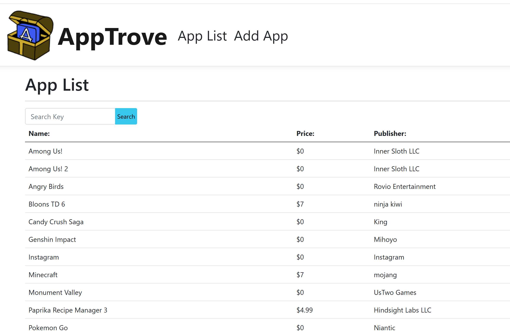

# AppTrove



AppTrove is a simple ASP.NET MVC web application designed to act as a database/catalog of applications. This project demonstrates basic web development skills, database integration, and the use of the ASP.NET MVC framework.

---

## Features

- Browse and view a list of apps.
- Basic CRUD functionality (Create, Read, Update, Delete) for managing app entries.
- Clean, simple user interface.
- Uses ASP.NET MVC framework and C#.

---

## Technologies Used

- **Framework:** ASP.NET MVC
- **Language:** C#
- **Database:** Local SQL Server / Entity Framework
- **IDE:** Visual Studio

---

## Setup / Running the Project

1. Clone this repository:  
   ```bash
   git clone https://github.com/Kelsey-Roberts/AppTrove-MVC-WebApp.git
